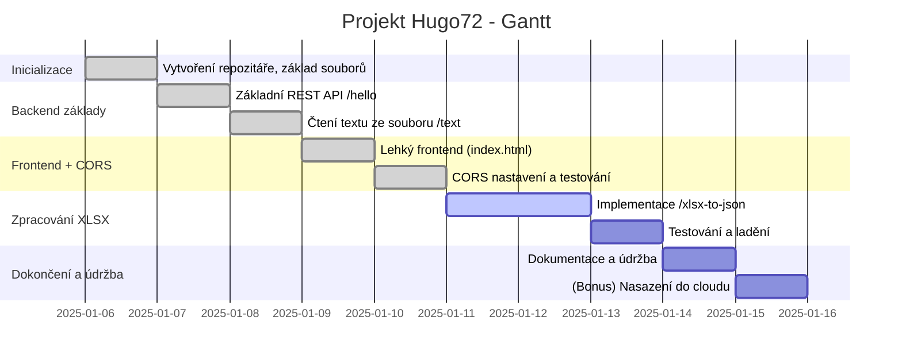
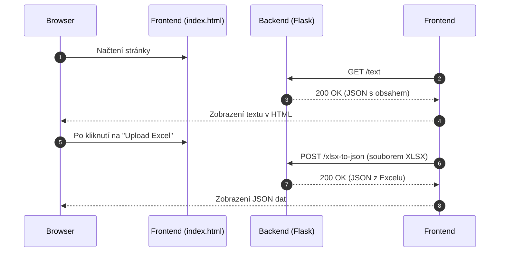
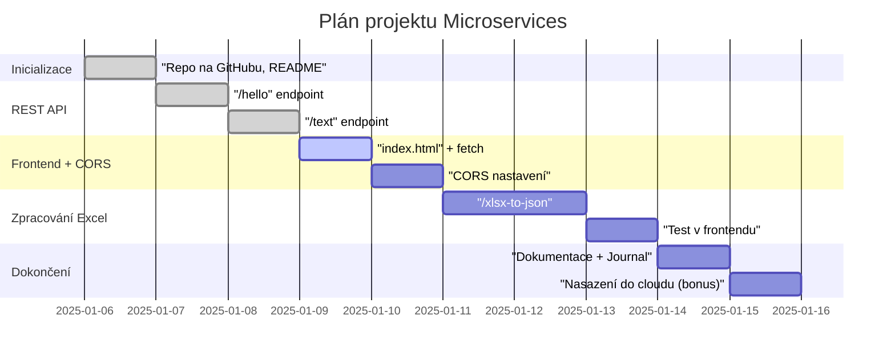

Níže najdeš návrh **projektového plánu** pro postupné budování REST API v Pythonu (pravděpodobně Flask nebo FastAPI) a k tomu jednoduchého frontendu. Zároveň jsem do plánu přidal **Project Journal**, kde je jednoduchá chronologie kroků a pomocí **Mermaid** grafů ukazuji jak časovou osu (Ganttův diagram), tak i sekvenční diagram komunikace.

---

## **Návrh projektového plánu**

1. **Inicializace projektu**  
   - Vytvoření repozitáře na GitHubu (public).  
   - Nastavení základní struktury projektu (např. `app.py`, `requirements.txt`, `.gitignore`).  
   - Zápis `README.md` s cíli projektu a instrukcemi k instalaci.  

2. **Základní REST API**  
   - Jednoduchý endpoint (např. `GET /hello`) vracející „Hello World“ text.  
   - Testování pomocí `curl` z terminálu.  

3. **Čtení a vracení textu ze souboru**  
   - Rozšíření backendu o endpoint (např. `GET /text`) načítající obsah lokálního souboru `sample.txt` a vracející jeho obsah.  
   - Testování opět pomocí `curl`.  

4. **Lehký frontend**  
   - Vytvoření jednoduché HTML stránky s JavaScriptem (stačí i jeden soubor `index.html`).  
   - Načtení textu z endpointu `/text` (AJAX/Fetch).  
   - Vyřešení CORS (povolíme volání z prohlížeče na REST API).  
   - Lokální test na `http://localhost:5000` (nebo jiném portu).  

5. **Zpracování Excel (XLSX) do JSON**  
   - Nainstalovat potřebné knihovny (např. `openpyxl` nebo `pandas`).  
   - Vytvořit endpoint (např. `POST /xlsx-to-json`), který přijme XLSX soubor nebo cestu k němu a vrátí JSON.  
   - Otestovat přes `curl` a poté případně i z frontendu (upload).  

6. **Dokumentace a údržba**  
   - Průběžně upravovat a psát do `Project Journal` (viz níže).  
   - Další zlepšení (logování, error handling, testy).  

7. **(Bonus) Nasazení**  
   - Základní deployment do cloudu (např. Heroku, Railway, AWS) a ukázka funkčnosti.  

---

## **Project Journal**

> Tento „journal“ je myšlen jako jeden soubor (např. `PROJECT_JOURNAL.md`) v repozitáři, kam budeš zapisovat postup. Můžeš jej pojmout i jako sérii commitů s popisem změn.

### **Den 1** – Inicializace
1. Vytvoření repozitáře na GitHubu: `github.com/uzivatel/projekt-hugo72` (public).  
2. Přidání základních souborů:  
   - `README.md` – krátké shrnutí projektu, jak nainstalovat Python a dependencies.  
   - `requirements.txt` – pro záznam závislostí (např. `Flask==2.2.3`).  
   - `.gitignore` – ignorování souborů `__pycache__`, `.DS_Store`, apod.  
3. První commit: „Inicializace projektu – základní soubory“.

### **Den 2** – Základní REST API
1. Instalace Flask (nebo FastAPI):  
   ```bash
   pip install flask
   ```
2. Vytvoření `app.py` s jednoduchým endpointem `/hello`, který vrací JSON:
   ```python
   from flask import Flask, jsonify

   app = Flask(__name__)

   @app.route('/hello', methods=['GET'])
   def hello():
       return jsonify({"message": "Hello World"})

   if __name__ == '__main__':
       app.run(debug=True)
   ```
3. Test pomocí `curl http://localhost:5000/hello`.  
4. Commit: „Přidán endpoint /hello“.

### **Den 3** – Čtení a vracení textu ze souboru
1. Vytvoření souboru `sample.txt` s testovacím textem.  
2. Rozšíření `app.py` o endpoint `/text`, který čte `sample.txt`:
   ```python
   @app.route('/text', methods=['GET'])
   def text_file():
       with open('sample.txt', 'r', encoding='utf-8') as f:
           content = f.read()
       return jsonify({"content": content})
   ```
3. Test pomocí `curl http://localhost:5000/text`.  
4. Commit: „Endpoint /text vrací obsah sample.txt“.

### **Den 4** – Lehký frontend + CORS
1. Vytvoření `index.html` s JavaScriptem, který přes `fetch` načte `/text` a zobrazí ho na stránce.  
2. Povolení CORS (pomocí knihovny `Flask-Cors` nebo ručním nastavením hlaviček):
   ```bash
   pip install flask-cors
   ```
   ```python
   from flask_cors import CORS
   CORS(app)
   ```
3. Otestuj v prohlížeči `file:///…/index.html` s `fetch('http://localhost:5000/text')`.  
4. Commit: „Zprovozněn CORS a jednoduchý frontend pro čtení textu“.

### **Den 5–6** – Zpracování Excel (XLSX) do JSON
1. Instalace knihovny pro čtení Excelu:
   ```bash
   pip install openpyxl
   ```
   Nebo pokud budeš chtít použít Pandas:
   ```bash
   pip install pandas
   ```
2. Přidání endpointu `/xlsx-to-json`:
   ```python
   import pandas as pd
   from flask import request

   @app.route('/xlsx-to-json', methods=['POST'])
   def xlsx_to_json():
       # Pokud pošleme soubor multipart/form-data:
       file = request.files['file']
       df = pd.read_excel(file)
       data = df.to_dict(orient='records')
       return jsonify(data)
   ```
   *Pozn.: Můžeš si vybrat, zda pošleš soubor jako `multipart/form-data`, nebo jestli endpoint jen čte soubor z disku.*  
3. Test pomocí:
   ```bash
   curl -F file=@data.xlsx http://localhost:5000/xlsx-to-json
   ```
4. Commit: „Endpoint /xlsx-to-json vrací JSON z Excelu“.

### **Den 7+** – Dokumentace a údržba
1. Přidání komentářů do kódu, úprava `README.md`.  
2. Možné rozšíření o logy, error handling, testy (Pytest).  
3. Bonus: Deployment do cloudu.  

---

## **Mermaid diagramy**

### **1. Ganttův diagram**  
Ukázkový Ganttův diagram postupu (dny jsou jen orientační):



### **2. Sekvenční diagram**  
Zobrazení, jak si bude vyměňovat data frontend a backend:



---

## **Závěrečné shrnutí**

Tento plán je dostatečně **modulární**: v každé fázi se věnuješ malé části projektu (REST endpoint, text, frontend, CORS, zpracování Excelu). Díky tomu si vyzkoušíš různé aspekty vývoje:

- **Backend** (Flask/FastAPI, čtení souborů, konverze dat).  
- **Frontend** (HTML/JS, AJAX/Fetch, řešení CORS).  
- **Zpracování dat** (Excel -> JSON).  
- **Verzování** (GitHub).  

Jakmile budou tyto kroky funkční, můžeš projekt dále rozšiřovat – např. přidat autentizaci, databázi, background jobs, případně vše rozdělit na více mikroslužeb. Ale základní struktura (a tvůj plán) je rozhodně dobrá cesta, jak se s REST API a mikroslužbami v Pythonu prakticky seznámit.  

Pokud máš cokoliv dalšího, co bys chtěl do plánu zahrnout (např. testování, Docker, CI/CD pipeline), dej vědět a doplníme to!

## 2025-01-06
Skvělé! Tady je stručná rekapitulace plánu s ohledem na nové **veřejné repozitáře** na GitHubu a pár tipů, jak postupovat:

---

## 1. **Repozitář na GitHubu**  
- Adresa: [github.com/fedo2/Mircroservices](https://github.com/fedo2/Mircroservices)  
- Vytvoř v něm (pokud už není):
  - `README.md` s popisem projektu a instrukcemi (instalace, spuštění).
  - `requirements.txt` (nebo `Pipfile`), kam budeš doplňovat Python balíčky.

---

## 2. **Iterační vývoj REST API + Frontend**  
Níže najdeš shrnutí kroků, abychom mohli průběžně commitovat a verziovat v GitHubu:

1. **Základní kostra aplikace**  
   - Soubor `app.py` (použij Flask nebo FastAPI).  
   - V `.gitignore` nezapomeň na `__pycache__` a další nepotřebné soubory.  
   - První commit: „Inicializace projektu“.

2. **Endpoint \`/hello\`**  
   - Jednoduchý návrat JSON: `{"message": "Hello World"}`.  
   - Test skrze `curl http://localhost:5000/hello`.  
   - Commit: „Endpoint /hello“.

3. **Čtení textového souboru \`sample.txt\`**  
   - Nový endpoint, např. `GET /text`, který vrátí obsah souboru.  
   - Test skrze `curl http://localhost:5000/text`.  
   - Commit: „Čtení obsahu souboru sample.txt“.

4. **Lehký frontend (HTML + JS)**  
   - Vytvoř `index.html`, použij `fetch()` pro volání `/text`.  
   - Ve Flasku zapni/povol CORS (např. `flask-cors` nebo ručně přidat hlavičky).  
   - Commit: „Přidána CORS konfigurace a jednoduchý frontend“.

5. **Zpracování Excel -> JSON**  
   - Použij `openpyxl` nebo `pandas`.  
   - Endpoint `POST /xlsx-to-json` přijme XLSX a vrátí JSON.  
   - Test přes `curl` (multipart form-data) nebo frontend.  
   - Commit: „Implementace endpointu /xlsx-to-json“.

6. **Dokumentace & údržba**  
   - Udržuj `README.md`, piš do něj, jak projekt spustit, testovat a nasadit.  
   - `PROJECT_JOURNAL.md` (nebo sekce v README) pro chronologický zápis.  
   - Po malých krocích pushuj do GitHubu.

---

## 3. **Project Journal**  
V repozitáři si založ buď **samostatný soubor** (`PROJECT_JOURNAL.md`) nebo používej **sekci v README**. Zapisuj tam:

1. **Datum** – Kdy jsi přidal novou funkcionalitu (např. 2025-01-10).  
2. **Popis** – Co přesně jsi změnil (endpointy, soubory, knihovny).  
3. **Způsob testování** – Jak jsi to zkoušel (curl, prohlížeč).  
4. **Další plány** – Co bys rád přidal, případně nápady na vylepšení.

Každý den/týden prostě sepíšeš krátkou rekapitulaci. To usnadní dohledávání chyb a zajišťuje přehled o projektu.

---

## 4. **Mermaid diagramy**  
Pro lepší čitelnost a dokumentaci je můžeš mít třeba přímo v `README.md` nebo v `docs/diagramy.md`.  

- **Gantt** pro časový přehled.  
- **Sekvenční diagram** pro ukázku komunikace frontendu a backendu.

Příklad Gantt diagramu (upraveno pro repo na GitHubu):


---

## 5. **Doporučení a rozšíření**  
- **Testy**: Cílem je naučit se základy, ale pokud budeš mít chuť, zkus i jednotkové testy (např. `pytest`).  
- **Nasazení**: Zvaž Heroku, Railway nebo AWS, abys vyzkoušel production prostředí.  
- **CI/CD**: Při dalším rozšíření projektu můžeš přidat GitHub Actions pro automatické testy nebo lintování.  

---

### **Závěr**
Tvůj plán je **výborný** pro pozvolný postup a naučení se základů. Stačí vše iterovat, dělat malé commity a mít přehled v `Project Journal`. Pokud narazíš na problém (CORS, instalace knihoven, Docker atd.), stačí se ozvat a probereme to podrobněji.

Držím palce a těším se na další pokroky v repozitáři  
[github.com/fedo2/Mircroservices](https://github.com/fedo2/Mircroservices)!  

Díky za upřesnění. Níže je shrnutí plánu s aktualizovaným odkazem na repozitář:

---

## 1. **Repozitář na GitHubu**  
- Adresa: [github.com/fedo2/Microservices](https://github.com/fedo2/Microservices)  
- V repu (pokud ještě není):
  - `README.md` s popisem projektu a instrukcemi k instalaci/spuštění.  
  - `requirements.txt` (nebo `Pipfile`), kam budeš přidávat Python balíčky.  
  - `.gitignore` (např. pro `__pycache__`, `.DS_Store`, atd.).

---

## 2. **Iterační vývoj REST API + Frontend**  
Pro připomenutí klíčové kroky:

1. **Základní kostra aplikace**  
   - Soubor `app.py` pro Flask (nebo FastAPI).  
   - První commit: „Inicializace projektu“.  

2. **Endpoint `/hello`**  
   - Vrací např. `{"message": "Hello World"}`.  
   - Test pomocí `curl http://localhost:5000/hello`.  
   - Commit: „Endpoint /hello“.

3. **Čtení textového souboru**  
   - Endpoint `GET /text` vrací obsah `sample.txt`.  
   - Test pomocí `curl http://localhost:5000/text`.  
   - Commit: „Čtení obsahu souboru sample.txt“.

4. **Lehký frontend (HTML + JS) + CORS**  
   - `index.html` s voláním `fetch('/text')`.  
   - Povolit CORS (buď `flask-cors`, nebo ručně v hlavičkách).  
   - Commit: „Zprovozněný frontend + CORS“.

5. **Zpracování Excel -> JSON**  
   - Endpoint `POST /xlsx-to-json` používá `openpyxl` nebo `pandas`.  
   - Test pomocí `curl -F file=@data.xlsx ...`.  
   - Commit: „Implementace endpointu /xlsx-to-json“.

6. **Dokumentace & údržba**  
   - `README.md`, který vysvětluje postup instalace, spouštění.  
   - `PROJECT_JOURNAL.md` s chronologickými záznamy (anebo zápis do README).  
   - Commit průběžně se změnami: „Journal update“.

---

## 3. **Project Journal**  
V repozitáři buď zvláštní soubor (např. `PROJECT_JOURNAL.md`), kam si budeš psát:

- **Datum** přidání nových funkcí.  
- **Popis** – co jsi změnil, jaké soubory upravil.  
- **Způsob testování**.  
- **Další plány**.

Formou krátkých poznámek nebo klidně i delších odstavců. Každý commit navíc může mít stručné vysvětlení změn.

---

## 4. **Mermaid diagramy**  
Pro lepší čitelnost a dokumentaci je můžeš dávat:

- **Do README.md** (GitHub je podporuje).  
- Nebo do `docs/diagramy.md`.  

Příklad Gantt diagramu:



---

## 5. **Doporučená rozšíření (po dokončení základů)**  
- **Jednotkové testy:** Nástroj `pytest` – testování endpointů a funkčnost.  
- **Docker:** Vytvořit `Dockerfile` pro snadné spuštění kdekoli.  
- **CI/CD:** GitHub Actions (např. automatické testy, linting).  
- **Cloud deployment:** Heroku, Railway, Vercel, AWS.  

---

### **Shrnutí**  
S opraveným odkazem [github.com/fedo2/Microservices](https://github.com/fedo2/Microservices) můžeš nyní pokračovat dle stanoveného plánu. Pokud cokoli nebude fungovat nebo bude potřeba dovysvětlit, stačí se ozvat a projdeme to krok za krokem. Hodně štěstí s dalším vývojem!

Níže najdeš příklad adresářové struktury projektu **Microservices**, která je vhodná pro menší až střední Python/Flask projekty. Obsahuje základní složky pro kód, statické soubory (frontend), šablony, dokumentaci a testy. Můžeš si ji upravit dle svých potřeb.

```
Microservices/
├── .gitignore            # Ignorované soubory (např. __pycache__, venv, atd.)
├── README.md             # Základní informace o projektu a návod
├── requirements.txt      # Přehled Python balíčků a verzí
├── Project_Journal.md    # Chronologický záznam postupu a poznámek
├── app.py                # Hlavní vstupní bod aplikace (Flask/FastAPI)
├── docs/
│   ├── diagrams.md       # Mermaid diagramy a případná dokumentace
│   └── images/           # Případné obrázky/obrázkové přílohy
├── static/
│   ├── css/             # Kaskádové styly
│   ├── js/              # JavaScript (frontend)
│   └── img/             # Obrázky či ikony pro frontend
└── templates/
    └── index.html       # HTML šablony pro Flask (nebo jen statický frontend)

```

### Popis obsahu:

1. **`.gitignore`**  
   - Slouží k ignorování zbytečných či citlivých souborů:  
     - Složky `__pycache__`, `.vscode`, `.idea`, případně `venv/`  
     - Soubor `.DS_Store` (macOS) atd.

2. **`README.md`**  
   - Zde můžeš uvést:
     - Účel projektu (o co jde).  
     - Postup instalace (např. `pip install -r requirements.txt`).  
     - Jak projekt spustit (`python app.py`).  
     - Seznam endpointů nebo API dokumentaci.

3. **`requirements.txt`**  
   - Obsahuje konkrétní verze Python knihoven:  
     ```txt
     Flask==2.2.3
     pandas==1.5.2
     openpyxl==3.0.10
     flask-cors==3.0.10
     ```
   - Uživatel si jednoduše nainstaluje závislosti příkazem:
     ```bash
     pip install -r requirements.txt
     ```

4. **`Project_Journal.md`**  
   - Zde uchováváš deník projektu (co jsi kdy přidal, jak jsi testoval).  
   - Můžeš jej vést i formou blogu s datem a popisem změn.

5. **`app.py`** (nebo `main.py`)  
   - Hlavní soubor, ve kterém se nachází kód aplikace. Např.:
     ```python
     from flask import Flask, jsonify, request
     from flask_cors import CORS

     app = Flask(__name__)
     CORS(app)

     @app.route('/hello', methods=['GET'])
     def hello():
         return jsonify({"message": "Hello World"})

     if __name__ == '__main__':
         app.run(debug=True)
     ```

6. **`docs/`**  
   - Místo pro dokumentaci.  
   - `diagrams.md` může obsahovat Mermaid diagramy (Gantt, sekvenční diagramy).  
   - Podsložka `images/` pro uložené obrázky (např. screenshoty, UML).

7. **`static/`**  
   - Pro frontendové soubory, pokud chceš obsluhovat statické soubory přímo z Flasku.  
   - `css/` pro kaskádové styly.  
   - `js/` pro JavaScript kód komunikující např. s `/text`, `/xlsx-to-json` a podobně.  
   - `img/` pro obrázky.

8. **`templates/`**  
   - Pro HTML šablony ve Flasku (např. `index.html`, `layout.html`).  
   - Pokud jedeš čistě „statický“ frontend, můžeš mít HTML přímo v `static/` (a generovat jen API).  
   - V případě Jinja2 šablon:  
     ```python
     from flask import render_template

     @app.route('/')
     def index():
         return render_template('index.html')
     ```

### **Možné rozšíření** (dobrovolné)

- **`tests/`**:  
  - Složka pro jednotkové a integrační testy (např. `test_app.py`).  
- **`Dockerfile`**:  
  - Pro Dockerizaci aplikace, pokud budeš chtít nasazovat do kontejneru.  
- **`docker-compose.yml`**:  
  - Pokud potřebuješ další služby (databázi, frontu zpráv).  
- **`scripts/`**:  
  - Pomocné skripty pro build, deployment atd.

Tato struktura ti pomůže udržet pořádek v projektu a snadno oddělit **backend** část (Flask), **frontend** statiku, dokumentaci a doprovodné materiály. Samozřejmě si ji můžeš upravovat podle svých preferencí a velikosti projektu.
