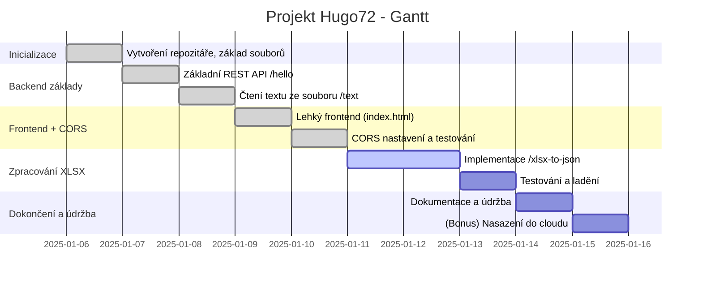
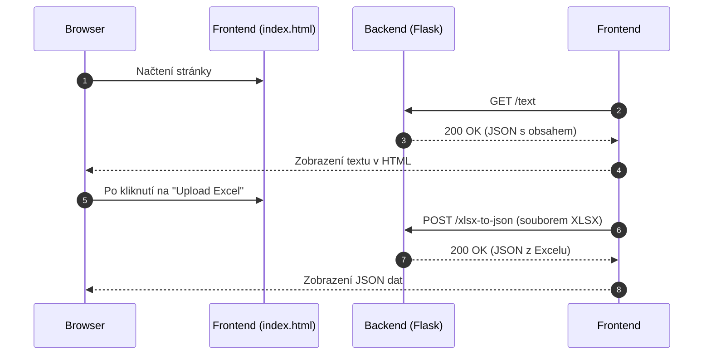

Níže najdeš návrh **projektového plánu** pro postupné budování REST API v Pythonu (pravděpodobně Flask nebo FastAPI) a k tomu jednoduchého frontendu. Zároveň jsem do plánu přidal **Project Journal**, kde je jednoduchá chronologie kroků a pomocí **Mermaid** grafů ukazuji jak časovou osu (Ganttův diagram), tak i sekvenční diagram komunikace.

---

## **Návrh projektového plánu**

1. **Inicializace projektu**  
   - Vytvoření repozitáře na GitHubu (public).  
   - Nastavení základní struktury projektu (např. `app.py`, `requirements.txt`, `.gitignore`).  
   - Zápis `README.md` s cíli projektu a instrukcemi k instalaci.  

2. **Základní REST API**  
   - Jednoduchý endpoint (např. `GET /hello`) vracející „Hello World“ text.  
   - Testování pomocí `curl` z terminálu.  

3. **Čtení a vracení textu ze souboru**  
   - Rozšíření backendu o endpoint (např. `GET /text`) načítající obsah lokálního souboru `sample.txt` a vracející jeho obsah.  
   - Testování opět pomocí `curl`.  

4. **Lehký frontend**  
   - Vytvoření jednoduché HTML stránky s JavaScriptem (stačí i jeden soubor `index.html`).  
   - Načtení textu z endpointu `/text` (AJAX/Fetch).  
   - Vyřešení CORS (povolíme volání z prohlížeče na REST API).  
   - Lokální test na `http://localhost:5000` (nebo jiném portu).  

5. **Zpracování Excel (XLSX) do JSON**  
   - Nainstalovat potřebné knihovny (např. `openpyxl` nebo `pandas`).  
   - Vytvořit endpoint (např. `POST /xlsx-to-json`), který přijme XLSX soubor nebo cestu k němu a vrátí JSON.  
   - Otestovat přes `curl` a poté případně i z frontendu (upload).  

6. **Dokumentace a údržba**  
   - Průběžně upravovat a psát do `Project Journal` (viz níže).  
   - Další zlepšení (logování, error handling, testy).  

7. **(Bonus) Nasazení**  
   - Základní deployment do cloudu (např. Heroku, Railway, AWS) a ukázka funkčnosti.  

---

## **Project Journal**

> Tento „journal“ je myšlen jako jeden soubor (např. `PROJECT_JOURNAL.md`) v repozitáři, kam budeš zapisovat postup. Můžeš jej pojmout i jako sérii commitů s popisem změn.

### **Den 1** – Inicializace
1. Vytvoření repozitáře na GitHubu: `github.com/uzivatel/projekt-hugo72` (public).  
2. Přidání základních souborů:  
   - `README.md` – krátké shrnutí projektu, jak nainstalovat Python a dependencies.  
   - `requirements.txt` – pro záznam závislostí (např. `Flask==2.2.3`).  
   - `.gitignore` – ignorování souborů `__pycache__`, `.DS_Store`, apod.  
3. První commit: „Inicializace projektu – základní soubory“.

### **Den 2** – Základní REST API
1. Instalace Flask (nebo FastAPI):  
   ```bash
   pip install flask
   ```
2. Vytvoření `app.py` s jednoduchým endpointem `/hello`, který vrací JSON:
   ```python
   from flask import Flask, jsonify

   app = Flask(__name__)

   @app.route('/hello', methods=['GET'])
   def hello():
       return jsonify({"message": "Hello World"})

   if __name__ == '__main__':
       app.run(debug=True)
   ```
3. Test pomocí `curl http://localhost:5000/hello`.  
4. Commit: „Přidán endpoint /hello“.

### **Den 3** – Čtení a vracení textu ze souboru
1. Vytvoření souboru `sample.txt` s testovacím textem.  
2. Rozšíření `app.py` o endpoint `/text`, který čte `sample.txt`:
   ```python
   @app.route('/text', methods=['GET'])
   def text_file():
       with open('sample.txt', 'r', encoding='utf-8') as f:
           content = f.read()
       return jsonify({"content": content})
   ```
3. Test pomocí `curl http://localhost:5000/text`.  
4. Commit: „Endpoint /text vrací obsah sample.txt“.

### **Den 4** – Lehký frontend + CORS
1. Vytvoření `index.html` s JavaScriptem, který přes `fetch` načte `/text` a zobrazí ho na stránce.  
2. Povolení CORS (pomocí knihovny `Flask-Cors` nebo ručním nastavením hlaviček):
   ```bash
   pip install flask-cors
   ```
   ```python
   from flask_cors import CORS
   CORS(app)
   ```
3. Otestuj v prohlížeči `file:///…/index.html` s `fetch('http://localhost:5000/text')`.  
4. Commit: „Zprovozněn CORS a jednoduchý frontend pro čtení textu“.

### **Den 5–6** – Zpracování Excel (XLSX) do JSON
1. Instalace knihovny pro čtení Excelu:
   ```bash
   pip install openpyxl
   ```
   Nebo pokud budeš chtít použít Pandas:
   ```bash
   pip install pandas
   ```
2. Přidání endpointu `/xlsx-to-json`:
   ```python
   import pandas as pd
   from flask import request

   @app.route('/xlsx-to-json', methods=['POST'])
   def xlsx_to_json():
       # Pokud pošleme soubor multipart/form-data:
       file = request.files['file']
       df = pd.read_excel(file)
       data = df.to_dict(orient='records')
       return jsonify(data)
   ```
   *Pozn.: Můžeš si vybrat, zda pošleš soubor jako `multipart/form-data`, nebo jestli endpoint jen čte soubor z disku.*  
3. Test pomocí:
   ```bash
   curl -F file=@data.xlsx http://localhost:5000/xlsx-to-json
   ```
4. Commit: „Endpoint /xlsx-to-json vrací JSON z Excelu“.

### **Den 7+** – Dokumentace a údržba
1. Přidání komentářů do kódu, úprava `README.md`.  
2. Možné rozšíření o logy, error handling, testy (Pytest).  
3. Bonus: Deployment do cloudu.  

---

## **Mermaid diagramy**

### **1. Ganttův diagram**  
Ukázkový Ganttův diagram postupu (dny jsou jen orientační):



### **2. Sekvenční diagram**  
Zobrazení, jak si bude vyměňovat data frontend a backend:



---

## **Závěrečné shrnutí**

Tento plán je dostatečně **modulární**: v každé fázi se věnuješ malé části projektu (REST endpoint, text, frontend, CORS, zpracování Excelu). Díky tomu si vyzkoušíš různé aspekty vývoje:

- **Backend** (Flask/FastAPI, čtení souborů, konverze dat).  
- **Frontend** (HTML/JS, AJAX/Fetch, řešení CORS).  
- **Zpracování dat** (Excel -> JSON).  
- **Verzování** (GitHub).  

Jakmile budou tyto kroky funkční, můžeš projekt dále rozšiřovat – např. přidat autentizaci, databázi, background jobs, případně vše rozdělit na více mikroslužeb. Ale základní struktura (a tvůj plán) je rozhodně dobrá cesta, jak se s REST API a mikroslužbami v Pythonu prakticky seznámit.  

Pokud máš cokoliv dalšího, co bys chtěl do plánu zahrnout (např. testování, Docker, CI/CD pipeline), dej vědět a doplníme to!  