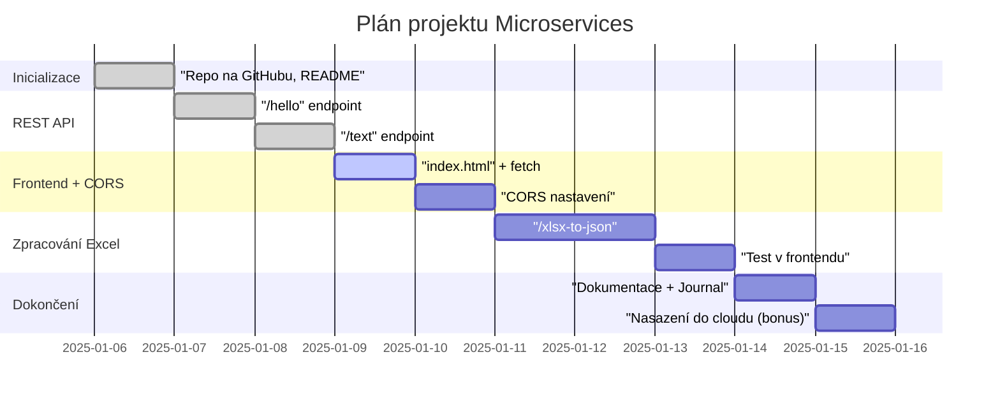

```mermaid
gantt
    dateFormat  YYYY-MM-DD
    title       Plán projektu Microservices

    section Inicializace
    "Repo na GitHubu, README": done, 2025-01-06, 1d

    section REST API
    "/hello" endpoint: done, 2025-01-07, 1d
    "/text" endpoint: done, 2025-01-08, 1d

    section Frontend + CORS
    "index.html" + fetch: active, 2025-01-09, 1d
    "CORS nastavení": 2025-01-10, 1d

    section Zpracování Excel
    "/xlsx-to-json": 2025-01-11, 2d
    "Test v frontendu": 2025-01-13, 1d

    section Dokončení
    "Dokumentace + Journal": 2025-01-14, 1d
    "Nasazení do cloudu (bonus)": 2025-01-15, 1d
```

---

